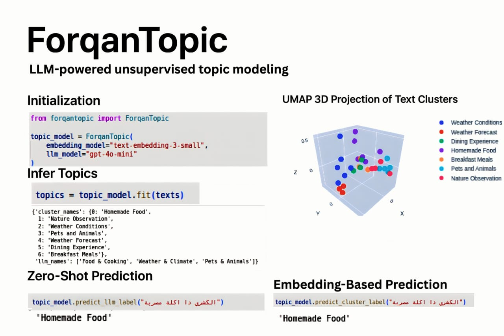

# ForqanTopic

**ForqanTopic** is a modular, unsupervised topic modeling library that combines state-of-the-art embeddings, dimensionality reduction, clustering, and LLM-based topic naming.

Built for flexibility, clarity, and experimentation.




---

## 🔧 What It Does

ForqanTopic transforms raw text into structured topics using the following pipeline:

1. **Preprocessing** – Strips, lowers, removes empty/short/duplicate texts.
2. **Embeddings** – Generate vector representations via OpenAI/LiteLLM models.
3. **Dimensionality Reduction** – Reduce with UMAP.
4. **Clustering** – Group similar embeddings (HDBSCAN, KMeans, etc.).
5. **Topic Naming** – Sample cluster centers and name them via LLM.
6. **Topic Assignment** – Predict topic names for all input texts.

---

## 🚀 Key Features

- ✅ Plug-and-play LLMs & embeddings via [LiteLLM](https://github.com/BerriAI/litellm)
- 🧩 Modular pipeline (preprocess → embed → reduce → cluster → label)
- 📊 Multiple clustering algorithms supported
- 📌 Topic naming with LLMs or keywords
- 📈 Built-in clustering evaluation (silhouette, coherence, CH-index, etc.)

---

## 📦 Installation

```bash
pip install -e .
```

Or install from source after cloning:

```bash
git clone https://github.com/Ahmed-Ousama/forqantopic.git
cd forqantopic
pip install -r requirements.txt
```

---

## ⚡ Quick Example

```python
from forqantopic import ForqanTopic

texts = [
    "AI is transforming healthcare.",
    "Cryptocurrency markets are volatile.",
    "Doctors use AI to diagnose diseases."
]

ft = ForqanTopic()
ft.fit(texts)

df = ft.transform_using_llm()
print(df)
```

---

## 🧪 Supported Clustering Methods

ForqanTopic supports multiple clustering backends that can be set via `clustering_method`:

- `kmeans` – classic partitioning around cluster centers
- `hdbscan` – density-based clustering with automatic cluster count (default)
- `dbscan` – density-based clustering without needing cluster count
- `gmm` – Gaussian Mixture Models with soft assignment
- `agglomerative` – hierarchical bottom-up merging
- `spectral` – graph-based clustering using nearest neighbors
- `birch` – efficient clustering for large datasets

Set via:
```python
ForqanTopic(clustering_method="kmeans")
```

---

## 📉 Supported Dimensionality Reduction Methods

You can reduce embedding dimensions using any of the following methods via `reducer_method`:

- `umap` (default) – Non-linear, fast and preserves both local and global structure
- `pca` – Linear method that retains maximum variance; ideal for dense vectors
- `tsne` – Great for 2D/3D visualization of high-dimensional data
- `svd` – Efficient for sparse data or matrix factorization cases

🔧 **Auto Component Selection**:
ForqanTopic uses a hybrid strategy that combines:
- **PCA Variance Threshold** (e.g. 95% variance)
- **Elbow Method** (second derivative on variance decay)

This selects an optimal `n_components` automatically unless overridden.

Set via:
```python
ForqanTopic(reducer_method="pca")
```

---

## 📊 Evaluation Metrics

Internal:
- Silhouette Score
- Calinski-Harabasz Index
- Davies-Bouldin Index
- Topic Coherence
- Inter-topic Distance

---

## 🧱 API Overview

```python
ForqanTopic(
    embedding_model="text-embedding-3-small",
    llm_model="gpt-4o-mini",
    reducer_method="umap",
    clustering_method="hdbscan",
    n_components=5,
    n_clusters=None
)
```

### Core Methods

- `fit(texts)` – Full pipeline: clean → embed → reduce → cluster → name
- `evaluate()` – Returns clustering quality metrics
- `transform_using_llm()` – Assigns LLM-based topic names to texts
- `transform()` – Assigns cluster-based topic names to texts
- `fit_transform_using_llm(texts)` – One-liner for LLM-based assignment
- `fit_transform_using_clusters(texts)` – One-liner for cluster-based assignment
- `predict_llm_label(text)` – Predict label using LLM
- `predict_cluster_label(text)` – Predict label using similarity to cluster centers
- `visualize()` – Plot UMAP scatter of clusters

---

## 📂 Project Structure

```
forqantopic/
├— core.py               # Pipeline logic
├— embedding.py          # Embedding handling
├— reduction.py          # UMAP logic
├— clustering.py         # Clustering methods
├— topic_namer.py        # LLM-based naming
├— evaluation.py         # Metric computation
├— preprocessing.py      # Text cleaning
└— visualization.py      # UMAP plotting
```

---

## 📜 License

MIT

---

## 🤝 Contributing

PRs welcome! This project is built to be extended — feel free to fork, improve, or add more clustering/evaluation components.

